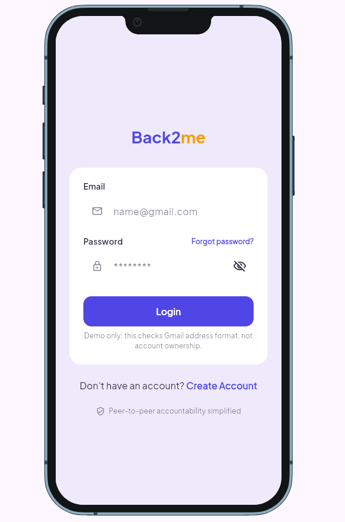
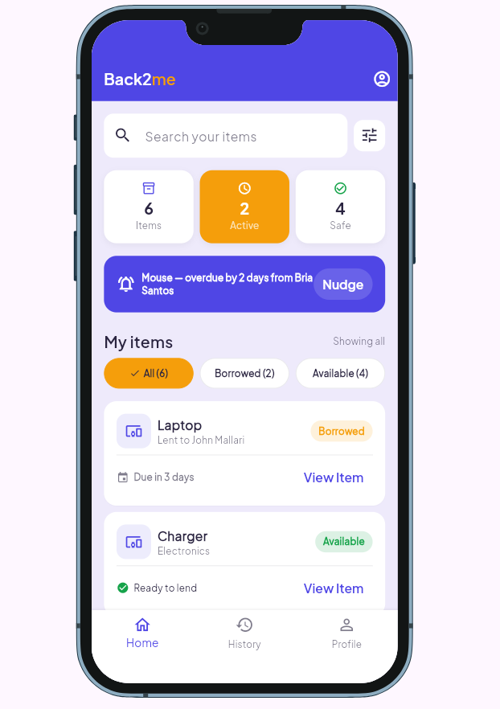
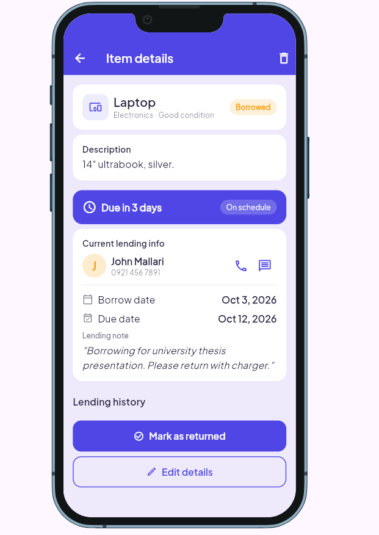
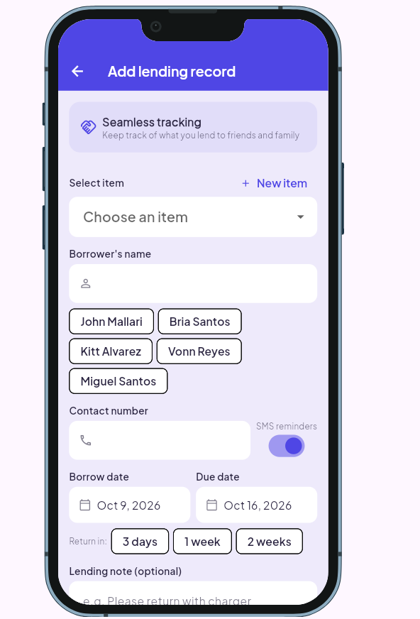
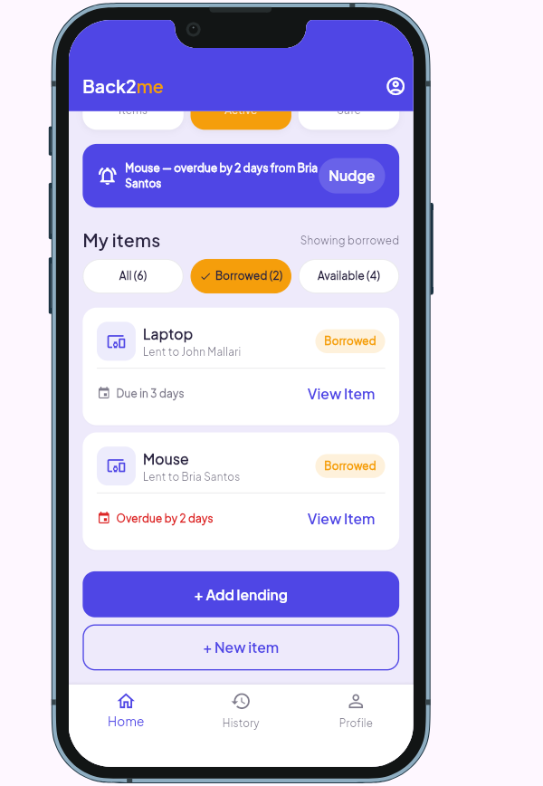
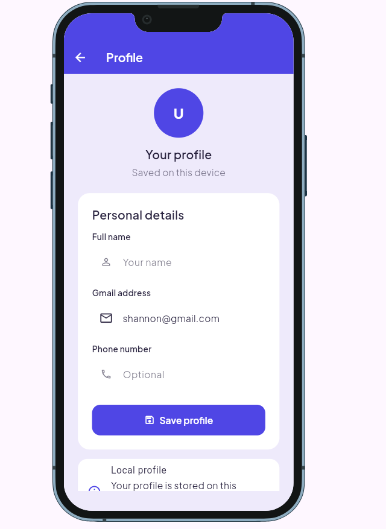
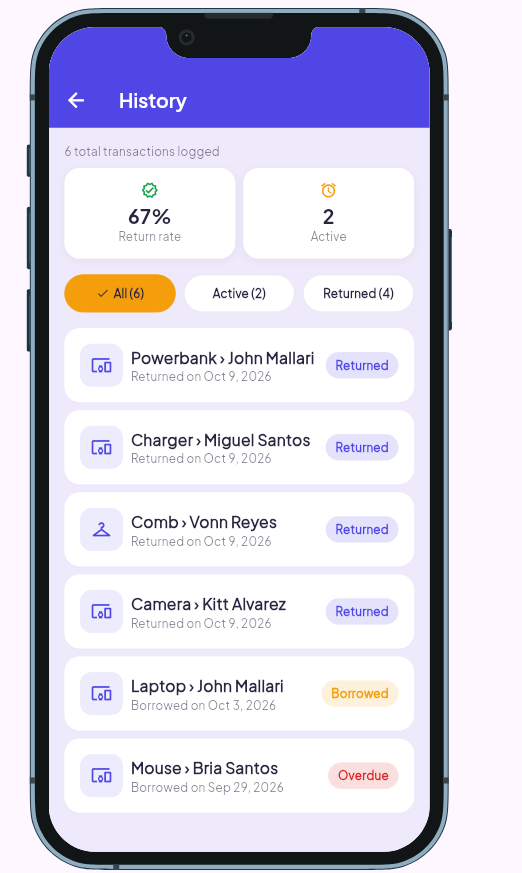

# Back2me

**Live demo:** https://skpriniel.github.io/Back2me/

**Demo video:** 

**Course:** Applications Development and Emerging Technologies (6ADET), Holy Angel University

**Author:** skpriniel

## 1. Overview

Back2me is a personal belongings lending tracker that helps users keep track of items they lend to other people. It records information about items, borrowers, lending dates, return dates, and item status so users can avoid forgetting who borrowed their belongings. It is designed for people who frequently lend personal items to friends, family, classmates, or coworkers.

The app uses local storage, so each user has their own items and lending records. The MVP does not require a server because one user's records should not appear on another person's device.

## 2. Setup and installation
The specific SDK versions used to build the app are Flutter 3.47.2 and Dart 3.13.2.

To run the project:

1. Install Flutter and ensure the Flutter toolchain is on your PATH.
2. Clone the repository and open its folder in VS Code or a terminal.
3. Install the project dependencies:

**flutter pub get**

4. Check that Flutter can detect a connected device or emulator:

**flutter devices**

## 3. How to run it

Start the app with:

**flutter run**

For a browser preview:

**flutter run -d chrome**

## 4. Features and usage

**Login Screen**
The Login Screen allows the user to sign in to their Back2me account. The user enters their email and password, with an option to show or hide the password. Users who do not have an account can proceed to the account creation screen, while the Forgot Password option provides access to the password reset flow.

**Home Screen**
The Home Screen provides an overview of the user's lending activity. It displays owned, borrowed, and returned item counts and allows users to search or filter their items. Users can select an item to view its details or use the + Add Lending button to create a new lending record. The Home Screen also provides a nudge option for items with approaching return dates.

**Item Details Screen**
The Item Details Screen displays the complete lending information for a selected item. The user can view the item's lending timeline and borrower information. Contact options are available through the call and message buttons. The user can also send a reminder to the borrower, mark the item as returned, or edit its details.

**Lending Records Screen**
The Lending Records / History Screen allows the user to review their lending activity. It displays information about the user's return rate and active lending records. The user can switch between All, Active, and Returned records and select a record to view its details.

**Add Lending Record Screen**
The Add Lending Record Screen allows the user to create a new lending record. The user selects an item, enters the borrower's name and contact number, and sets the borrow and due dates. The user can also enable SMS reminders. Quick-select options for 3 days, 1 week, or 2 weeks can automatically set the due date. If the item is not yet registered, the user can select + New Item to create it.

**Primary Flow**
The primary flow begins when the user signs in through the Login Screen. From the Home Screen, the user can search or filter their items and select an item to view its details. To lend an item, the user selects + Add Lending and fills in the required lending information. The new record can then be viewed and monitored through the Lending Records / History Screen. When the item is close to its due date, the user can send a nudge to the borrower. Once the item is returned, the user can mark it as returned through the Item Details Screen.

## 5. Project structure
lib/
- main.dart
- Screens/
  - login_screen.dart
  - home_screen.dart
  - item_details_screen.dart
  - lending_records_screen.dart
  - add_lending_record_screen.dart
- Models/
  - item.dart
  - lending_record.dart

**Important Files**
main.dart: Entry point of the Back2me Flutter application.
screens/: Contains the main screens of the application.
login_screen.dart: Handles the Login Screen and user sign-in interface.
home_screen.dart:	Displays the user's items and lending activity.
item_details_screen.dart:	Displays the details and current lending status of an item.
lending_records_screen.dart: Displays active and previous lending records.
add_lending_record_screen.dart:	Provides the form for creating or editing a lending record.
models/:	Contains the data models used by the application.
item.dart: Defines the information stored for each item.
lending_record.dart: Defines the information stored for each lending transaction.
 

## 6. Screenshots

| Login | Home | Item Detail |
| --- | --- | --- |
|  |  |  |
| Add Lending Record | Lending Record | Profile | 
|  |  |  |
| History |
|  

## 7. Known issues and next steps

**Known Issues**
- Data Synchronization Risks: Incorrect connections between items, borrowers, and lending records could cause inaccurate information display. Maintaining proper state sync between item status and lending status during borrow/return actions remains a key focus area.
- Scope Delimitation (Stretch Goals): Push notifications, item photos, search, category filtering, and direct borrower contact remain stretch goals to ensure core MVP functionality is prioritzed.

**Next Steps**
- Complete CRUD operations for core entities (Items, Borrowers, and Lending Records).
- Connect items and borrowers accurately within lending transactions.
- Implement and validate the Available → Borrowed → Returned state workflow.
- Finalize Hive / Hive CE local database integration and test data persistence across app restarts.
- Verify web platform compatibility and run cross-browser testing.
- Evaluate stretch goals (e.g., push notifications, filtering, photos, profile) once primary MVP milestones are met.
  

## Security checklist
see security checklist: [security-checklist.md](https://github.com/skpriniel/Back2me/blob/main/security-checklist.md)

## AI usage

The app was developed with Codex and Copilot for code suggestions, UI structure, debugging, API integration, and documentation, while the final implementation was reviewed and adjusted by the author. See [AI-USAGE.md](https://github.com/skpriniel/Back2me/blob/main/AI-USAGE.md). for more details.

## License
Copyright © 2026 skpriniel. [MIT License](https://github.com/skpriniel/Back2me/blob/main/LICENSE).

